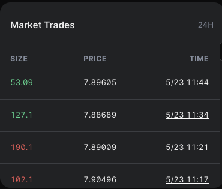

# Data Sources 

## Smart Contracts

We see smart contracts as the default data source. For anything that is retrievable via smart contracts directly, we mostly will get them by reading the contracts.

### Exploring Data

**Please find the contract addresses in the metadata**

- Optimistic: [https://metadata.perp.exchange/v2/optimism.json](https://metadata.perp.exchange/v2/optimism.json)
- Optimistic Kovan: [https://metadata.perp.exchange/v2/optimism-kovan.json](https://metadata.perp.exchange/v2/optimism-kovan.json)

**You can then search the address with the blockchain explorer to see the read/write interface of the contracts**

- Optimistic: [https://optimistic.etherscan.io/](https://optimistic.etherscan.io/)
- Optimistic Kovan: [https://kovan-optimistic.etherscan.io/](https://kovan-optimistic.etherscan.io/)

### Usage Examples
:::note
Please check out https://github.com/perpetual-protocol/sdk-curie, a Javascript SDK to interface with our v2 smart contracts.
:::

---

## The Graph

We use [The Graph](https://thegraph.com/) as the default on-chain data indexing service. For any data that cannot be retrieved from smart contracts directly, for example some aggregated data, we mostly will fetch from The Graph.

### Exploring Data

- Use either of the provided servers:
    
    ```json
    "graphServerConfigs": [
    	{
    		"url": "https://api.thegraph.com/subgraphs/name/perpetual-protocol/perpetual-v2-optimism",
    		"wsUrl": "wss://api.thegraph.com/subgraphs/name/perpetual-protocol/perpetual-v2-optimism",
    		"healthUrl": "https://api.thegraph.com/index-node/graphql",
    		"name": "perpetual-protocol/perpetual-v2-optimism"
    	},
    	{
    		"url": "https://subgraph-api-singapore.perp.fi/subgraphs/name/perpetual-protocol/perpetual-v2-optimism",
    		"wsUrl": "wss://subgraph-ws-singapore.perp.fi/subgraphs/name/perpetual-protocol/perpetual-v2-optimism",
    		"healthUrl": "https://subgraph-singapore.perp.fi:8030/graphql",
    		"name": "perpetual-protocol/perpetual-v2-optimism"
    	}
    ]
    ```
    
- You will see a GraphQL explorer interface by opening the URL.
    
    
    

### Usage Examples

- Market Detail / Funding Rate (8h)
    


    
- Market Detail / Trades
    

    
- Market Detail / Fills
    

    
- History (all tabs)
    

    

---

## AppSync

We use [AppSync](https://aws.amazon.com/appsync/) as an alternative to The Graph for time sensitive data, e.g. price chart series, since The Graph can sometimes be out of sync or unstable. We use as little data from AppSync as possible since AppSync is centralized.

### Exploring Data

- Please use the keys provided below to connect
    
    ```json
    "candleServerConfigs": [
    	{
    		"url": "https://4b3vdz2hdjho7gzuo4wl2jgsoe.appsync-api.ap-southeast-1.amazonaws.com/graphql",
    		"region": "ap-southeast-1",
    		"key": "xxxxxxxxxx"
    	}
    ],
    "statisticsServerConfigs": [
    	{
    		"url": "https://4b3vdz2hdjho7gzuo4wl2jgsoe.appsync-api.ap-southeast-1.amazonaws.com/graphql",
    		"region": "ap-southeast-1",
    		"key": "xxxxxxxxxx"
    	}
    ]
    ```


### Usage Examples

- Candle Price Chart
- Market Statistics
    - funding rate
    - volume24h
    - Change (24h)
- Reward
    - Gas Rebate
    - Liquidity Mining
    

    
- Pool APR
    


    

---

## Examples of Mixed Data Sources

- TVL
    - `pool` from **The Graph**
    - `markPrice` from **smart contracts**
    
    ```bash
    pool.baseAmount.mul(markPrice).add(pool.quoteAmount)
    ```
    
- 24h Fees
    - `volume24h` from A**ppSync**
    - `exchangeFeeRatios` from **smart contracts**
    - `pool` from **The Graph**
    
    ```bash
    volume24h.mul(exchangeFeeRatios[pool.baseAddress])
    ```
    
- Liquidity Pool
    

