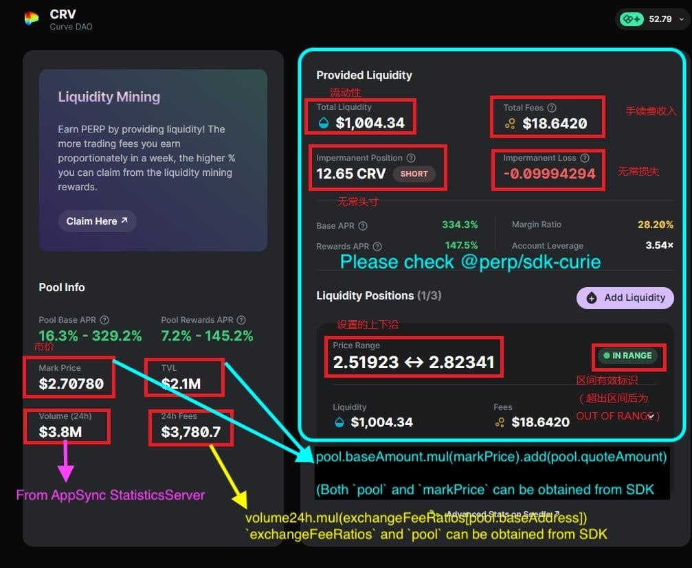

# Get Pool Info

# Data sources

## Metadata

- Optimism: [https://metadata.perp.exchange/v2/optimism.json](https://metadata.perp.exchange/v2/optimism.json)
- Optimism Kovan: [https://metadata.perp.exchange/v2/optimism-kovan.json](https://metadata.perp.exchange/v2/optimism-kovan.json)

## The Graph

### Production

- Explorer: [https://thegraph.com/hosted-service/subgraph/perpetual-protocol/perpetual-v2-optimism](https://thegraph.com/hosted-service/subgraph/perpetual-protocol/perpetual-v2-optimism)
- Endpoint: [`https://api.thegraph.com/subgraphs/name/perpetual-protocol/perpetual-v2-optimism`](https://api.thegraph.com/subgraphs/name/perpetual-protocol/perpetual-v2-optimism)

### Staging

- Explorer: [https://thegraph.com/hosted-service/subgraph/perpetual-protocol/perpetual-v2-optimism-kovan](https://thegraph.com/hosted-service/subgraph/perpetual-protocol/perpetual-v2-optimism-kovan)
- Endpoint: [`https://api.thegraph.com/subgraphs/name/perpetual-protocol/perpetual-v2-optimism-kovan`](https://api.thegraph.com/subgraphs/name/perpetual-protocol/perpetual-v2-optimism-kovan)

### Example

```tsx
import fetch from "node-fetch"

const endpoint = "..."

const query = `{
  markets(first: 5) {
    id
    baseToken
    quoteToken
    pool
  }
}`

const resp = await fetch(endpoint, {
  method: "POST",
  headers: {
    "Content-Type": "application/json",
    Accept: "application/json",
  },
  body: JSON.stringify({ query }),
})

const result = await resp.json()
```

## Liquidity mining

### Production

- Endpoint: [`https://yvolsu5cy5gbhmwz7mxdykf744.appsync-api.ap-southeast-1.amazonaws.com/graphql`](https://yvolsu5cy5gbhmwz7mxdykf744.appsync-api.ap-southeast-1.amazonaws.com/graphql)
- API key: `da2-6w2rchhbdjgppd3atnzd2p5p2e`
- Expiry: Fri, 14 Jul 2023 01:00:00 GMT

### Staging

- Endpoint: [`https://35bjttmsnjamhjwemncbhnruuu.appsync-api.ap-northeast-1.amazonaws.com/graphql`](https://35bjttmsnjamhjwemncbhnruuu.appsync-api.ap-northeast-1.amazonaws.com/graphql)
- API key: `da2-hjrz6kdge5bznokglz4kwldr6a`
- Expiry: Wed, 19 Jul 2023 02:00:00 GMT

### GraphQL schema

```graphql
# Queries

type Query {
	# list all market APRs
	listMarketAprs(limit: Int, nextToken: String): MarketAprs

  # list all market APRs of a maker
	listMakerAprs(address: String!): MakerAprs

  # get claimable reward info for an account
	getClaimableRewards(address: String!): ClaimableRewards
}

# Schemas

type ClaimableRewards {
  # total perp reward amount of all weeks
	totalBalance: Float!

  # total perp reward USD notional of all weeks
	totalBalanceUsd: Float!

  # perp reward items
  # each item is corresponding to the reward for one week
  # only claimable weeks (hasn't claimed yet) will be returned
	items: [ClaimableReward]

  # total op reward amount of all weeks
  totalBalanceOp: Float!

  # total op reward USD notional of all weeks
	totalBalanceUsdOp: Float!
	
  # op reward items
  # each item is corresponding to the reward for one week
  # only claimable weeks (hasn't claimed yet) will be returned
	itemsOp: [ClaimableReward]
}

type MakerAprs {
    items: [MakerMarketApr]
}

type MarketAprs {
	items: [MarketApr]

  # pagination token
	nextToken: String
}

type ClaimableReward {
  # week ordinal
	week: Int!

  # merkle proof for reward claiming
	merkleProof: [String]
	
  # reward token amount in wei
	balance: String!
}

type MarketApr {
	# assembled base symbol and quote symbol. Ex: "vETH/vUSD"
	marketSymbol: String!
	
  # base token symbol. ex: vETH
  baseSymbol: String!
	
  # quote token symbol. ex: vUSD
	quoteSymbol: String!
	
  # lower value of base fee APR range
  lowerBaseApr: Float!

  # upper value of base fee APR range
	upperBaseApr: Float!

  # 3 base APR items corresponding to low, medium, high risks
  riskLevelBaseAprs: [Float]!

  # lower value of perp reward APR range
	lowerRewardApr: Float!

  # upper value of perp reward APR range
	upperRewardApr: Float!

  # 3 perp reward APR items corresponding to low, medium, high risks
  riskLevelRewardAprs: [Float]!

  # lower value of op reward APR range
	lowerRewardOpApr: Float!

  # upper value of op reward APR range
	upperRewardOpApr: Float!

  # 3 op reward APR items corresponding to low, medium, high risks
  riskLevelRewardOpAprs: [Float]!

  # perp reward cap
  rewardCapWeeklyPerp: Float!
  
  # op reward cap
  rewardCapWeeklyOp: Float!
}

type MakerMarketApr {
    # assembled base symbol and quote symbol. Ex: "vETH/vUSD"
    marketSymbol: String!

		# base token symbol. ex: vETH
    baseSymbol: String!

    # quote token symbol. ex: vUSD
    quoteSymbol: String!

    collectedFee: number
    uncollectedFee: number

    # collectedFee + uncollectedFee
    totalFee: number

    # USD value of all market orders
    netValue: number

    # base fee APR
    baseApr: Float!

    # perp reward APR
    rewardApr: Float!

    # estimated perp reward token amount
    estimatedRewardAmount: number

    # estimated perp reward USD value
    estimatedRewardUsd: number

    # op reward APR
    rewardOpApr: Float!

    # estimated op reward token amount
    estimatedRewardOpAmount: Float!

    # estimated op reward USD value
    estimatedRewardOpUsd: Float!
}
```

### Example

```tsx
import fetch from "node-fetch"

const endpoint = "..."
const apiKey = "..."

const query = `{
  listMarketAprs {
    items {
      baseSymbol
      lowerBaseApr
      lowerRewardApr
      lowerRewardOpApr
      upperBaseApr
      upperRewardApr
      upperRewardOpApr
    }
  }
}`

const resp = await fetch(endpoint, {
  method: "POST",
  headers: {
    "Content-Type": "application/json",
    Accept: "application/json",
		"x-api-key": apiKey,
  },
  body: JSON.stringify({ query }),
})

const result = await resp.json()
```

## Statistics

### Production

- Endpoint: [`https://4b3vdz2hdjho7gzuo4wl2jgsoe.appsync-api.ap-southeast-1.amazonaws.com/graphql`](https://4b3vdz2hdjho7gzuo4wl2jgsoe.appsync-api.ap-southeast-1.amazonaws.com/graphql)
- API key: `da2-6pzuogcgvvamdnv6sglgjnvk2a`
- Expiry: Sat, 04 Mar 2023 06:00:00 GMT

### Staging

- Endpoint: [`https://jvyyinoorbea5mnfucijfbw3xy.appsync-api.ap-northeast-1.amazonaws.com/graphql`](https://jvyyinoorbea5mnfucijfbw3xy.appsync-api.ap-northeast-1.amazonaws.com/graphql)
- API key: `da2-vs6aasj325avdmvb3qc264hxzm`
- Expiry: Wed, 19 Jul 2023 03:00:00 GMT

### GraphQL schema

```graphql
# Queries

type Query {
	getStatistics(ammAddr: String!): Statistics
}

# Schemas

type Statistics {
	ammAddr: String!
	lastTradePriceUsd: String
	volume24h: String
	baseVolume24h: String
	priceChangeRate24h: String
	priceHigh24h: String
	priceLow24h: String
	timestamp: Int!
	blockNumber: Int!
}
```

### Example

```tsx
import fetch from "node-fetch"

const endpoint = "..."
const apiKey = "..."

const ethMarketAddr = "0x8C835DFaA34e2AE61775e80EE29E2c724c6AE2BB"
const query = `{
  getStatistics(ammAddr: "${ethMarketAddr}") {
    ammAddr
    baseVolume24h
    blockNumber
    lastTradePriceUsd
    volume24h
    timestamp
  }
}`

const resp = await fetch(endpoint, {
  method: "POST",
  headers: {
    "Content-Type": "application/json",
    Accept: "application/json",
		"x-api-key": apiKey,
  },
  body: JSON.stringify({ query }),
})

const result = await resp.json()
```

# Get pool info



```tsx
import { PerpetualProtocol } from "@perp/sdk-curie"
import { Big } from "big.js"
import fetch from "node-fetch"

const main = async () => {
    const perp = new PerpetualProtocol({
        chainId: 10,
        providerConfigs: [{ rpcUrl: "https://mainnet.optimism.io" }],
    })
    await perp.init()

    const pool = perp.metadata.pools.find(p => p.baseSymbol == "ETH")!
    const baseAddrLowerCase = pool.baseAddress.toLowerCase()
    const ethMarket = perp.markets.getMarket({ baseAddress: baseAddrLowerCase })
    const prices = await ethMarket.getPrices()
    const markPrice = +prices.markPrice
    console.log({ markPrice })

    const result = await perp.markets.getMarketsBaseQuoteAmount([
        {
            id: "", //don't care
            pool: pool.address,
            baseToken: pool.baseAddress,
            quoteToken: pool.quoteAddress,
            tradingVolume: "", //don't care
            tradingFee: "", //don't care
        },
    ])
    const { baseAmount, quoteAmount } = result[pool.address]
    const tvl = Big(baseAmount).mul(markPrice).add(quoteAmount)
    console.log({ tvl: +tvl })

    const baseAddrCaseSensitive = perp.metadata.contracts["vETH"].address
    const resp = await fetch("https://4b3vdz2hdjho7gzuo4wl2jgsoe.appsync-api.ap-southeast-1.amazonaws.com/graphql", {
        method: "POST",
        headers: {
            "Content-Type": "application/json",
            Accept: "application/json",
            "x-api-key": "da2-6pzuogcgvvamdnv6sglgjnvk2a",
        },
        body: JSON.stringify({
            query: `{
                getStatistics(ammAddr: "${baseAddrCaseSensitive}") {
                  volume24h
                }
              }`,
        }),
    })
    const data = await resp.json()

    const volume24h = Big(data.data.getStatistics.volume24h)
    const fee24h = volume24h.mul(perp.clearingHouseConfig.marketExchangeFeeRatios[baseAddrLowerCase])
    console.log({ volume24h: +volume24h, fee24h: +fee24h })
}

if (require.main === module) {
    main().finally()
}
```
